id: getting_started_with_amg_and_streamlit_on_real-time_dashboarding
summary: This guide will walk you through how to build real-time dashboards with AMG and Streamlit to track data ingested by Snowpipe Streaming
categories: getting-started
environments: web
status: Published
feedback link: https://github.com/Snowflake-Labs/sfguides/issues
tags: Getting Started, Grafana, Streaming, Amazon MSK, Snowpipe Streaming, Streamlit, Container, ECS, Application Load Balancer
authors: James Sun

# Getting Started with Amazon Managed Service for Grafana and Streamlit to visualize real-time data
<!---------------------------->
## Overview
Duration: 10

Monitoring your real-time assets in Snowflake is crucial as it allows you to spot anomalies fast and handle the
incoming issues proactively to minimize the blast radius. 

Here are some of the use cases that can benefit from tracking your live data streams:
- Real-time traffic control
- Fraud detection in banking industry
- Oil pipeline safety monitoring
- Smart factory management

In this workshop, we will visualize real-time commercial flight data over the San Francisco Bay Area from the [Opensky Network](https://opensky-network.org) with [Amazon Managed Service for Grafana](https://aws.amazon.com/grafana/) and [Streamlit](https://streamlit.io/).
Supposedly, the real-time data has been captured and stored in Snowflake using [Snowpipe streaming](https://docs.snowflake.com/en/user-guide/data-load-snowpipe-streaming-overview) and [MSK (Amazon Managed Streaming for Apache Kafka)](https://aws.amazon.com/msk/) as described in this [quickstarts](https://quickstarts.snowflake.com/guide/getting_started_with_snowpipe_streaming_aws_msk/index.html?index=..%2F..index#0).

The architecture diagram below illustrates the deployment, with the non-greyed out area being the focus of our workshop.

The data in Snowflake table is visualized in real-time with [AMG (Amazon Managed Grafana)](https://aws.amazon.com/grafana/) and [Streamlit](https://streamlit.io)
Note that Streamlit is containerized and managed by [Amazon Elastic Container Service](https://aws.amazon.com/ecs/).

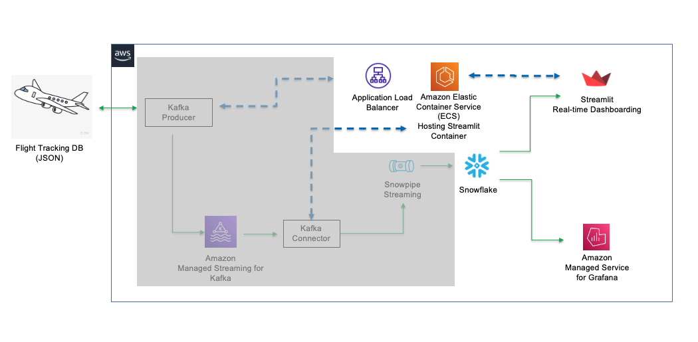


### Prerequisites

- Familiarity with Snowflake, basic SQL knowledge, Snowsight UI and Snowflake objects
- Familiarity with [Grafana](https://en.wikipedia.org/wiki/Grafana), [Docker](https://en.wikipedia.org/wiki/Docker_(software)), [Streamlit](https://streamlit.io/), AWS Services (e.g. ECS, VPC, etc) and the AWS Management Console
- Basic knowledge of Python programming
- Please `DO NOT` use Snowflake account in production for this workshop. Always use trial or test account for the demo purposes.

### What You'll Need Before the Lab

To participate in the virtual hands-on lab, attendees need the following resources.

- A [Snowflake Enterprise Account on preferred AWS region](https://signup.snowflake.com/) with `ACCOUNTADMIN` access
- Finished the quickstarts for [Snowpipe Streaming and Amazon MSK](https://quickstarts.snowflake.com/guide/getting_started_with_snowpipe_streaming_aws_msk/index.html?index=..%2F..index#0) and has ingested and kept live data in Snowflake.
- An [AWS Account](https://aws.amazon.com/premiumsupport/knowledge-center/create-and-activate-aws-account/) with `Administrator Access`
- Create your own VPC and subnets (This is optional if you have an existing VPC with subnets you can leverage. Please refer
to this [AWS document](https://docs.aws.amazon.com/whitepapers/latest/amazon-msk-migration-guide/amazon-managed-streaming-for-apache-kafka-amazon-msk.html) for the MSK networking topology)
  - In the AWS account, [create a VPC](https://docs.aws.amazon.com/vpc/latest/userguide/working-with-vpcs.html), preferrably in the same region as the Snowflake account
  - In the VPC, [create subnets](https://docs.aws.amazon.com/vpc/latest/userguide/working-with-subnets.html) and attach an [internet gateway](https://docs.aws.amazon.com/vpc/latest/userguide/VPC_Internet_Gateway.html) to allow egress traffic to the internet by using a routing table and security group for outbound traffic.
  Note that the subnets can be public or private, for private subnets, you will need to attach a [NAT gateway](https://docs.aws.amazon.com/vpc/latest/userguide/vpc-nat-gateway.html) to allow egress traffic to the internet. Public subnets are sufficient for this lab.
  - If you have decided to create your own VPC/subnets, for your convenience, click [here](https://console.aws.amazon.com/cloudformation/home?region=us-west-2#/stacks/new?stackName=MSK-Snowflake-VPC&templateURL=https://snowflake-corp-se-workshop.s3.us-west-1.amazonaws.com/VHOL_Snowflake_Snowpipe_Streaming_MSK/MyFullVPC-2pub-2priv.json) to deploy a VPC with a pair of public and private subnets, internet gateway and NAT gateway for you. 
Note that you must have network administrator permissions to deploy these resources. 

### What You'll Learn

- Using [MSK (Amazon Managed Streaming for Apache Kafka)](https://aws.amazon.com/msk/)
- Connecting to EC2 instances with [Amazon System Session Manager](https://docs.aws.amazon.com/systems-manager/latest/userguide/session-manager.html), this is an alternative
to SSH if your instance is in a private subnet
- Using [SnowSQL](https://docs.snowflake.com/en/user-guide/snowsql.html), the command line client for connecting to Snowflake to execute SQL queries and perform all DDL and DML operations, including loading data into and unloading data out of database tables.
- Using Snowflake to query tables populated with time-series data

### What You'll Build

- Create an ECS cluster and [Elastic load balancer](https://aws.amazon.com/elasticloadbalancing/) to frontend the Streamlit container
- Deploy Streamlit in ECS
- Deploy an [AMG workspace](https://docs.aws.amazon.com/grafana/latest/userguide/AMG-create-workspace.html)
- Build a Grafana dashboard to track live flight data

<!---------------------------->
## Data Ingestion, Option 1
Duration: 1

If you have just completed the quickstarts for [Snowpipe Streaming and Amazon MSK](https://quickstarts.snowflake.com/guide/getting_started_with_snowpipe_streaming_aws_msk/index.html?index=..%2F..index#0) and haven't clean up the database, there is no further actions required, just skip ahead to the section for `Monitor with Amazon Managed Service for Grafana (AMG)` on the left pane.

<!---------------------------->
## Data Ingestion, Option 2
Duration: 10

At this point, you can either choose to complete `Option 1` above first then skip ahead to the section for `Monitor with Amazon Managed Service for Grafana (AMG)` on the left pane, 
or you can start from scratch by processing some sample data before using AMG or Streamlit. 

#### 1. Creating user, role, and database in Snowflake
First login to your Snowflake account as a power user with ACCOUNTADMIN role. Then run the following SQL commands in a worksheet to create a user, database and the role that we will use in the lab.

```commandline
-- Set default value for multiple variables
-- For purpose of this workshop, it is recommended to use these defaults during the exercise to avoid errors
-- You should change them after the workshop
SET PWD = 'Test1234567';
SET USER = 'STREAMING_USER';
SET DB = 'MSK_STREAMING_DB';
SET SCHEMA = 'MSK_STREAMING_SCHEMA';
SET WH = 'MSK_STREAMING_WH';
SET ROLE = 'MSK_STREAMING_RL';

USE ROLE ACCOUNTADMIN;

-- CREATE USERS
CREATE USER IF NOT EXISTS IDENTIFIER($USER) PASSWORD=$PWD  COMMENT='STREAMING USER';

-- CREATE ROLES
CREATE OR REPLACE ROLE IDENTIFIER($ROLE);

-- CREATE DATABASE AND WAREHOUSE
CREATE DATABASE IF NOT EXISTS IDENTIFIER($DB);
USE IDENTIFIER($DB);
CREATE OR REPLACE WAREHOUSE IDENTIFIER($WH) WITH WAREHOUSE_SIZE = 'SMALL';

-- GRANTS
GRANT CREATE WAREHOUSE ON ACCOUNT TO ROLE IDENTIFIER($ROLE);
GRANT ROLE IDENTIFIER($ROLE) TO USER IDENTIFIER($USER);
GRANT OWNERSHIP ON DATABASE IDENTIFIER($DB) TO ROLE IDENTIFIER($ROLE);
GRANT USAGE ON WAREHOUSE IDENTIFIER($WH) TO ROLE IDENTIFIER($ROLE);
GRANT ROLE IDENTIFIER($ROLE) TO ROLE ACCOUNTADMIN;

-- SET DEFAULTS
ALTER USER IDENTIFIER($USER) SET DEFAULT_ROLE=$ROLE;
ALTER USER IDENTIFIER($USER) SET DEFAULT_WAREHOUSE=$WH;

-- SET TIME ZONE TO UTC
ALTER ACCOUNT SET TIMEZONE = 'UTC';

-- CREATE SCHEMA
USE DATABASE IDENTIFIER($DB);
USE ROLE IDENTIFIER($ROLE);
CREATE OR REPLACE SCHEMA IDENTIFIER($SCHEMA);

```

#### 2. Copy Sample Data into Snowflake

Run the following command to load sample flight data into Snowflake.

```commandline
USE DATABASE MSK_STREAMING_DB;
USE SCHEMA MSK_STREAMING_SCHEMA;
USE WAREHOUSE MSK_STREAMING_WH;

CREATE OR REPLACE STAGE FLIGHTS
URL='s3://jsnow-vhol-assets/amg/sample-flight-data/'
FILE_FORMAT = (TYPE = 'parquet');

CREATE OR REPLACE TABLE FLIGHTS_TBL
  (RECORDID NUMBER AUTOINCREMENT,
   V VARIANT)
  CHANGE_TRACKING = TRUE;

COPY INTO FLIGHTS_TBL (V) FROM
  (SELECT $1 FROM @FLIGHTS/)
  FILE_FORMAT=(TYPE = 'parquet');

SELECT * FROM FLIGHTS_TBL LIMIT 10;

```

Now you should see raw data in variant type is copied into the `FLIGHTS_TBL` table.

Next, we will create a view and run DDL to convert the raw data into a nicely formatted table.

```commandline
CREATE OR REPLACE VIEW FLIGHTS_O_VW
AS
SELECT
    V:utc::TIMESTAMP_NTZ ts_utc_o,
    CONVERT_TIMEZONE('UTC','America/Los_Angeles',TS_UTC_O::TIMESTAMP_NTZ) AS ts_pt,
    V:alt::INTEGER alt,
    V:id::TEXT id,
    V:icao::TEXT icao,
    V:dest::TEXT dest,
    V:orig::TEXT orig,
    V:lat::FLOAT lat,
    V:lon::FLOAT lon,
    ST_GEOHASH(TO_GEOGRAPHY(ST_MAKEPOINT(LON, LAT)),12) GEOHASH,
    YEAR(TS_UTC_O)::INTEGER yr,
    MONTH(TS_UTC_O)::INTEGER mo,
    DAY(TS_UTC_O)::INTEGER dd,
    HOUR(TS_UTC_O)::INTEGER hr
  FROM FLIGHTS_TBL;

SELECT * FROM FLIGHTS_O_VW LIMIT 10;

```

You should see the view `FLIGHTS_O_VW` with multiple columns for timestamps, altitude, longitude, latitude, destination airport, etc.


#### 3. Adjust the timestamps to current

Because the sample data is from a time in the past, we now need to adjust the old timestamps to current to simulate the real-time pattern.
Run the following commands to adjust the timestamps.

```commandline
-- ADJUST TIME STAMPS
CREATE OR REPLACE VIEW FLIGHTS_VW AS
SELECT *, DATEADD(SECOND, (SELECT DATE_PART(EPOCH_SECOND, CURRENT_TIMESTAMP())
 - DATE_PART(EPOCH_SECOND, MAX(TS_UTC_O)) FROM FLIGHTS_O_VW), TS_UTC_O) AS TS_UTC FROM FLIGHTS_O_VW;

SELECT TS_UTC_O, TS_UTC FROM FLIGHTS_VW ORDER BY TS_PT DESC;

```

Now you should see the timestamps are adjusted to the current time.

#### 4. Create a task to adjust the timestamps continuously
We need to run a task in the background every minute to simulate the incoming stream of new data by running the following commands:

```commandline
-- CREATE A TASK TO UPDATE TIMESTAMP EVERY MINUTE
CREATE OR REPLACE TASK TASK1
 WAREHOUSE = MSK_STREAMING_WH
 SCHEDULE = '1 MINUTE'
AS
CREATE OR REPLACE VIEW FLIGHTS_VW AS
SELECT *, DATEADD(SECOND, (SELECT DATE_PART(EPOCH_SECOND, CURRENT_TIMESTAMP()) - DATE_PART(EPOCH_SECOND, MAX(TS_UTC_O)) FROM FLIGHTS_O_VW), TS_UTC_O) AS TS_UTC FROM FLIGHTS_O_VW;

USE ROLE ACCOUNTADMIN;
GRANT EXECUTE TASK ON ACCOUNT TO ROLE MSK_STREAMING_RL;
USE ROLE MSK_STREAMING_RL;
ALTER TASK TASK1 RESUME;
SHOW TASKS;

```

The task is scheduled to run evey minute.


<!---------------------------->
## Monitor with Amazon Managed Service for Grafana (AMG)
Duration: 20

Before we start, for simplicity reason, we will set the timezone in Snowflake as `UTC`.
Run the following command as the Administrator to change the default timezone to UTC:

```commandline
USE ROLE ACCOUNTADMIN;
ALTER ACCOUNT SET TIMEZONE = 'UTC';

```

#### 1. Create an AMG workspace

First, click [here](https://console.aws.amazon.com/cloudformation/home?region=us-west-2#/stacks/new?stackName=AMG&templateURL=https://snowflake-corp-se-workshop.s3.us-west-1.amazonaws.com/VHOL_AMG_Streamlit_Streaming/amg.json)
to launch an AMG workspace. Note the default AWS region is `us-west-2 (Oregon)`, feel free to select a region you prefer to deploy the environment.

Click `Next` at the `Create stack` page. 
Set the Stack name or modify the default value to customize it to your identity.

See below sample screen capture for reference.

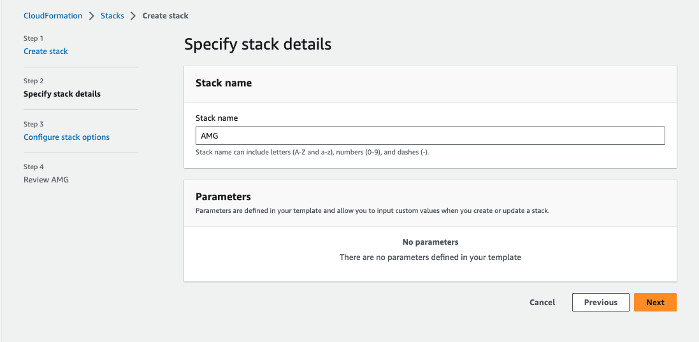

Leave everything as default in the `Configure stack options` page and click `Next`.
In the `Review` page, check `
I acknowledge that AWS CloudFormation might create IAM resources` in the `Capabilities` section, click `Submit`.

In about 10 minutes, the Cloudformation template provisions an AMG workspace. 

#### 2. Upgrade to Grafana Enterprise
Go to the AWS [AMG workspace console](https://console.aws.amazon.com/grafana/home?#/workspaces) in the same region where you deployed the Cloudformation template.
The [Snowflake Plugin for Grafana](https://grafana.com/grafana/plugins/grafana-snowflake-datasource/) is only available in [Grafana Enterprise](https://grafana.com/products/enterprise/. We will need to upgrade our current workspace to the enterprise version. 
Click on the name of the workspace, then click `Upgrade to Grafana Enterprise`. 


In the next page, check `30-day free trial`, review the terms and conditions before clicking `Subscribe`.


In a few minutes, the upgrade is complete. You now have 30 day to try out the Grafana Enterprise edition with Snowflake plugin for free.

#### 3. Assign an Administrator for Grafana UI

Go back to the AWS [AMG workspace console](https://console.aws.amazon.com/grafana/home?#/workspaces).
Click on the name of the workspace, we need to assign new user(s) for this workspace, including the Administrator of the
Grafana UI. If you already have previously set up `AWS IAM Identity Center (Successor to AWS SSO)`, you will be prompted to assign new user or group. Click `Assign new user or group` located under the `Authentication` tab.

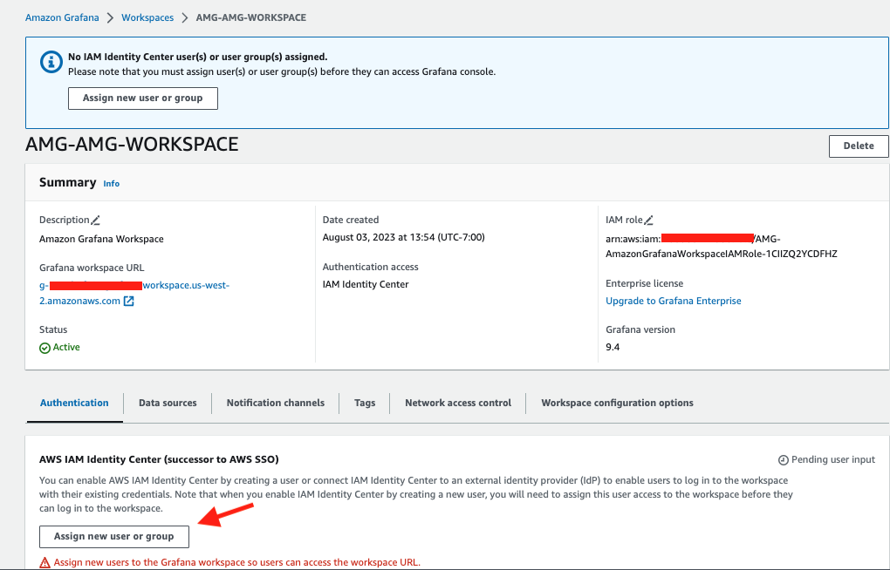

If you have not set up IAM Identity Center, you will be prompted to enable it. Click on `Enable` then click `Assign new user or group`.
Note that you will probably need to add a new user in IAM Identity Center, please refer to this [doc](https://docs.aws.amazon.com/singlesignon/latest/userguide/addusers.html) to complete this step.
You will need to add at least one user who will also be the Administrator of Grafana UI.

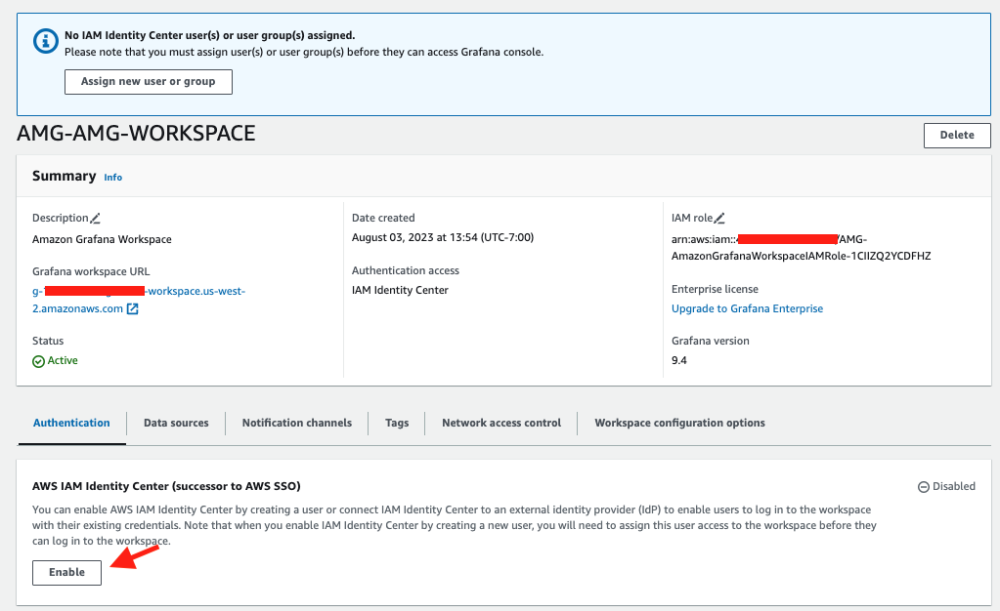

Coming back to the page for assigning new user, check the user who you wish to assign to the workspace and click `Assign users and groups`.

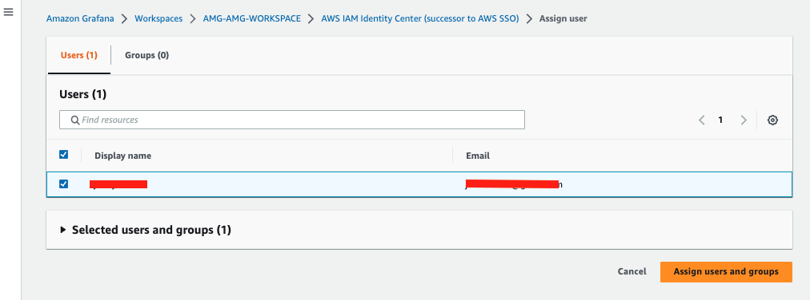

Now we need to promote this user's role from Viewer to Administrator. Check the user and select `Make admin` in the `Action` drop-down menu.


#### 4. Work with Grafana UI
Go back to the AWS [AMG workspace console](https://console.aws.amazon.com/grafana/home?#/workspaces). Click on the Grafana URL. 


You should see the Grafana sign in page. Click on the `Sign in with AWS IAM Identity Center` button.


At this point, you will be prompted to enter username and password for authentication. Depending on how your IAM Identity Center is setup, you may also have to perform a MFA (Multi-Factor Authentication). 


Once logged in, click the hamburger menu located in the top-left corner of the page, select `Data sources` from the Administration drop-down menu.

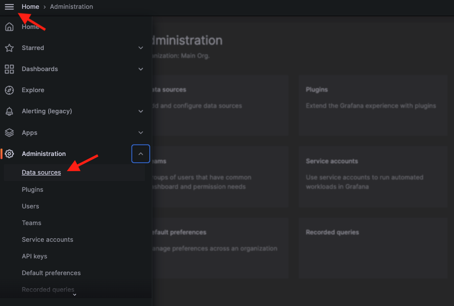

In the search box, type in Snowflake, and the Snowflake plugin appears. Click on it.


Type in the name for your source, e.g., `Snowflake` and the connection info such as your Snowflake account locator, its AWS region, username `streaming_user` and password `Test1234567`. For Environment, type in the role `msk_streaming_rl`, warehouse `msk_streaming_wh`, database `msk_streaming_db` and schema `msk_streaming_schema` you used in the quickstarts for [Snowpipe Streaming and Amazon MSK](https://quickstarts.snowflake.com/guide/getting_started_with_snowpipe_streaming_aws_msk/index.html?index=..%2F..index#0)  Leave the remaining options as default and click ‘Save & test’. You will see the ‘Data source is working’ sign when it is done.
If you are not sure about the Snowflake account locator, please run the following query in Snowflake to get it:

```commandline
WITH HOSTLIST AS 
(SELECT * FROM TABLE(FLATTEN(INPUT => PARSE_JSON(SYSTEM$allowlist()))))
SELECT REPLACE(VALUE:host,'.snowflakecomputing.com','') AS ACCOUNT_IDENTIFIER
FROM HOSTLIST
WHERE VALUE:type = 'SNOWFLAKE_DEPLOYMENT';

```

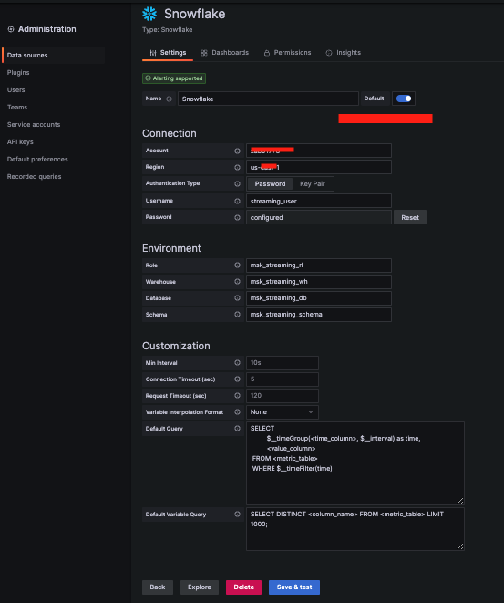

Now download a [dashboard template](https://snowflake-corp-se-workshop.s3.us-west-1.amazonaws.com/VHOL_AMG_Streamlit_Streaming/flights-msk-streaming-AMG.json) and save it in your local computer.

In the UI, click the hamburger menu, click Dashboards, then select `Import` from the `New` drop-down menu. Drag and drop the downloaded template, select `Snowflake` as the data source, click `Import` to complete the import.


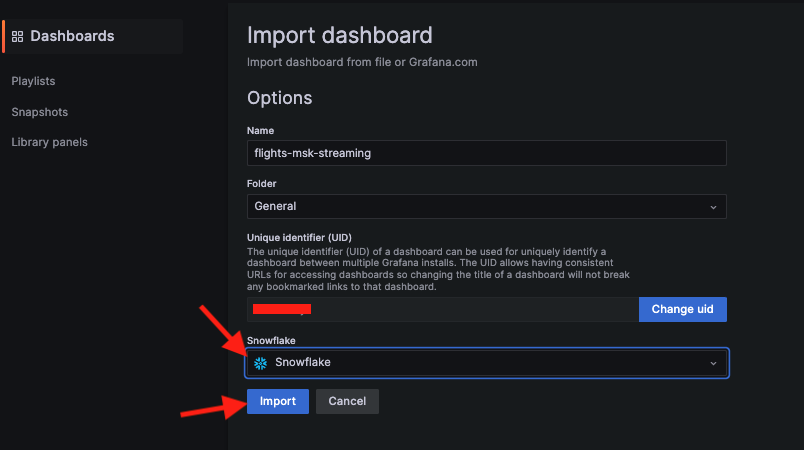

Now you should be able to see the sample dashboard that tracks the real-time flight data.

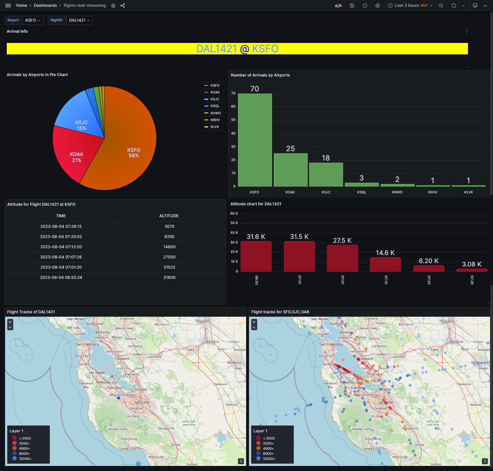

To learn more about Grafana's features, feel free to visit their [documentation portal](https://grafana.com/docs/).

## Monitor with Streamlit
Duration: 15

For developers with Python skills, they might want to quickly develop a custom monitoring dashboard of their own.
Streamlit will be a great tool for this use case as it is open-source and can use all the supported Python graphic libraries to build sleek dashboards.

Here we are going to containerize a Streamlit script that retrieves real-time flight data from Snowflake and visualize them in a similar fashion as Grafana.
The container is orchestrated by Amazon ECS and front-ended by an [Application Load Balancer (ALB)](https://docs.aws.amazon.com/elasticloadbalancing/latest/application/introduction.html).

First click [here](https://console.aws.amazon.com/cloudformation/home?region=us-west-2#/stacks/new?stackName=EcsStreamlit&templateURL=https://snowflake-corp-se-workshop.s3.us-west-1.amazonaws.com/VHOL_AMG_Streamlit_Streaming/ecs-alb.json) to
deploy the environment with Cloudformation. Click `Next`.

In the next page, pick a stack name and ECS cluster name of your choice, pick the VPC and Subnets where you want to deploy the ECS cluster. For Snowflake parameters, use
the default ones (already filled in) from the [Snowpipe Streaming and Amazon MSK](https://quickstarts.snowflake.com/guide/getting_started_with_snowpipe_streaming_aws_msk/index.html?index=..%2F..index#0) workshop if you have not changed them. 
For `SnowflakeAccount`, run the following command in your Snowflake cluster to get the `Account Identifier`:

```
WITH HOSTLIST AS 
(SELECT * FROM TABLE(FLATTEN(INPUT => PARSE_JSON(SYSTEM$allowlist()))))
SELECT REPLACE(VALUE:host,'.snowflakecomputing.com','') AS ACCOUNT_IDENTIFIER
FROM HOSTLIST
WHERE VALUE:type = 'SNOWFLAKE_DEPLOYMENT_REGIONLESS';
```

Leave everything else as default and click `Next`. 

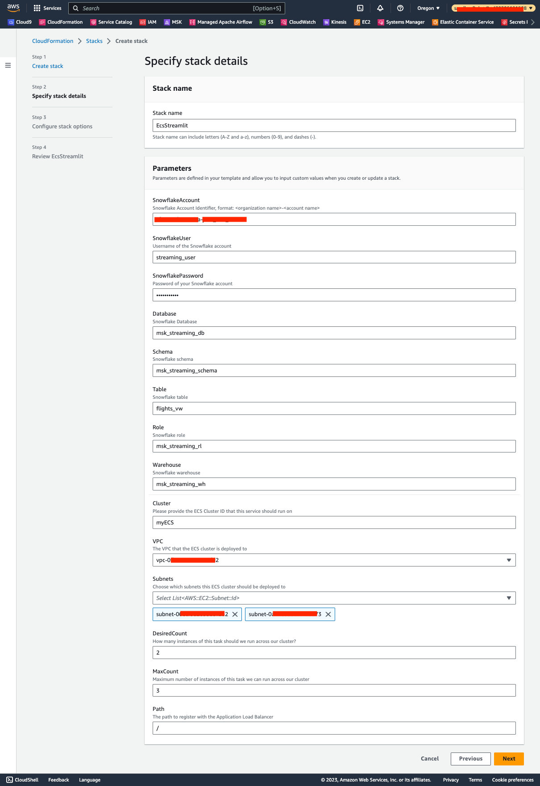

At the `Review` page, check the `Capabilities` and click `Submit`. 
In less than 10 minutes, the environment should deploy successfully, navigate to the `Output` tab, and click the URL for the ALB.

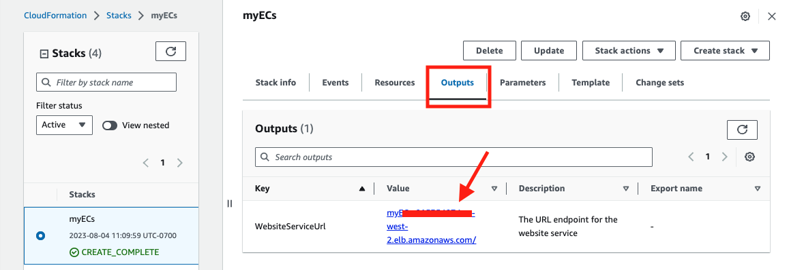

Now you should be able to see the sample dashboard built with Streamlit.

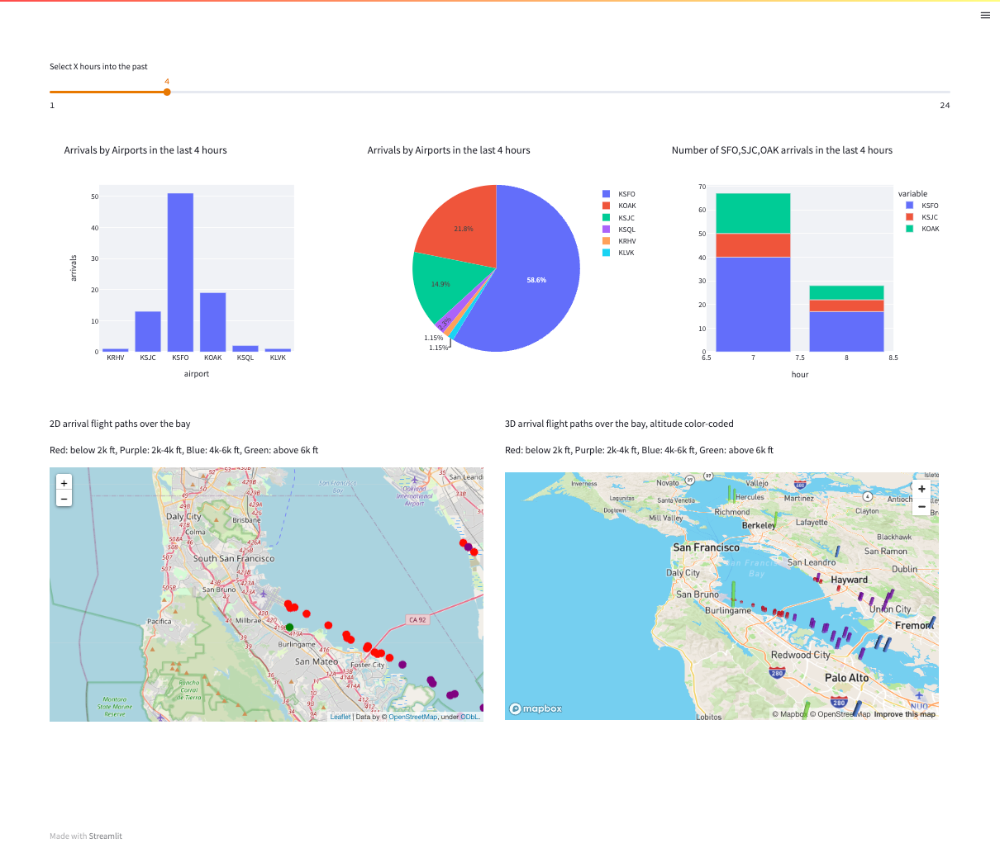

Here is the [source code](https://github.com/sfc-gh-jsun/sfquickstarts/blob/master/site/sfguides/src/getting_started_with_amg_and_streamlit_on_real-time_dashboarding/assets/opensky.py) for Streamlit. 

<!---------------------------->
## Conclusions
Duration: 5

In this lab, we built a demo to show how to use AMG and Streamlit to visualize and monitor live flight data, we also provided sample Grafana dashboard and Streamlit code for you to get started quickly.

Related Resources

- [Streamlit](https://streamlit.io/)
- [Amazon Managed Service for Grafana](https://aws.amazon.com/grafana/)
- [Getting started with Snowflake](https://quickstarts.snowflake.com/)
- [Snowflake on AWS Marketplace](https://aws.amazon.com/marketplace/seller-profile?id=18d60ae8-2c99-4881-a31a-e74770d70347)
- [Snowflake for Data Sharing](https://www.snowflake.com/Workloads/data-sharing/)
- [Snowflake Marketplace](https://www.snowflake.com/en/data-cloud/marketplace/)

